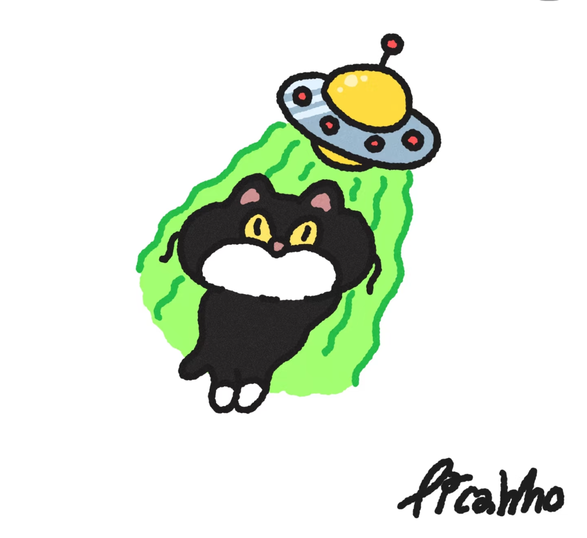
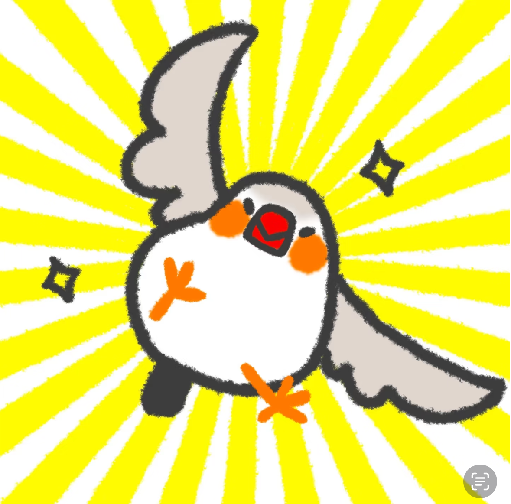
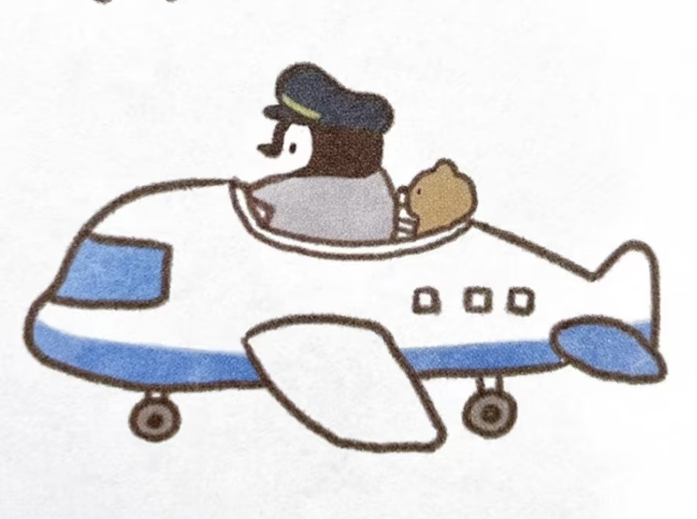
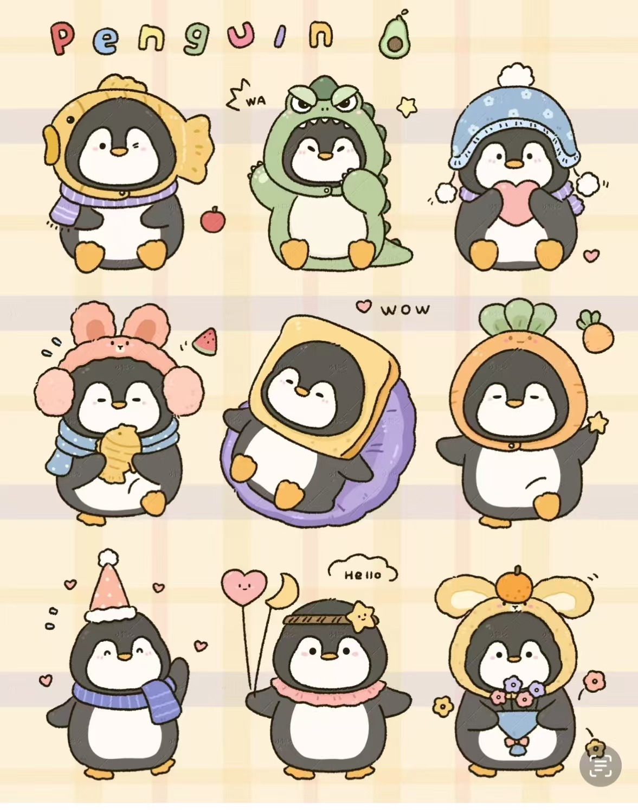

# SHOP

### TOOLS

### OUTFIT

------

### TOOLS

------

#### Bamboo Dragonfly

- **Usage Method:**
  
  - Use in segments: The player can use it multiple times within the total duration.
  - Effect -- Increase height: When the player presses the button, the penguin will be elevated to a fixed **Y-axis height** and simultaneously move along the **X-axis at a fixed low speed**.
  
- How to use?

  Click the button `Q`

- Level

  | Level        | Duration  | Price                   |
  | ------------ | --------- | ----------------------- |
  | Primary      | 3 seconds | cheapest                |
  | Intermediate | 5 seconds | the same as 'bird'      |
  | Advanced     | 7 seconds | cheaper than 'airplane' |

------

#### UFO

**Usage Method:**

- One-time use

- Effect -- After summoning, different surprise effects can be triggered, including:

  - Speed boost for 5 seconds
  - Rewind to the starting point
  - Vertical lift to an extremely high altitude

- How to use?

  Click the button `U`

- No level

- Price: ?

------

#### Mount （just can choose one?)

##### Bird

**Usage Method:**

- One-time use

- Effect -- After summoning, it will assist in flying (at a relatively slow speed) for 5 seconds.

- How to use?

  Click the button `W`

- No level

##### Airplane

**Usage Method:**

- One-time use

- Effect -- After summoning, it will assist in flying (at a relatively fast speed) for 7 seconds.

- How to use?

  Click the button `W`

- No level

------

#### Magic Potion

- Effect: Get one extra life.

#### Double Coins

------

### OUTFIT

------

