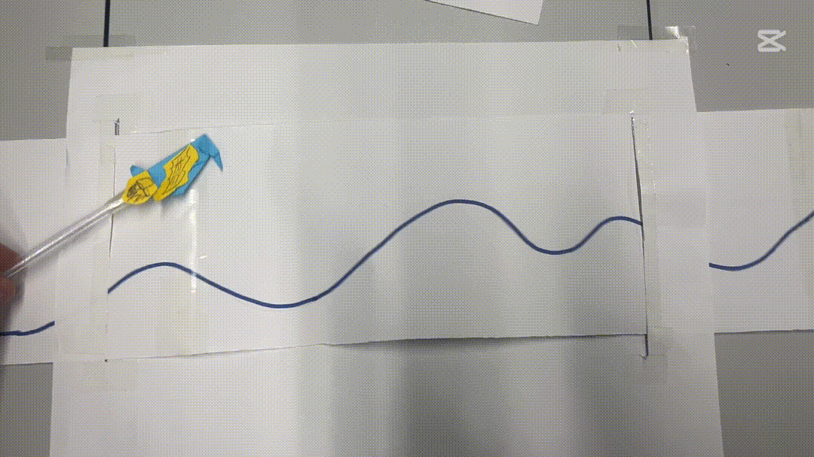
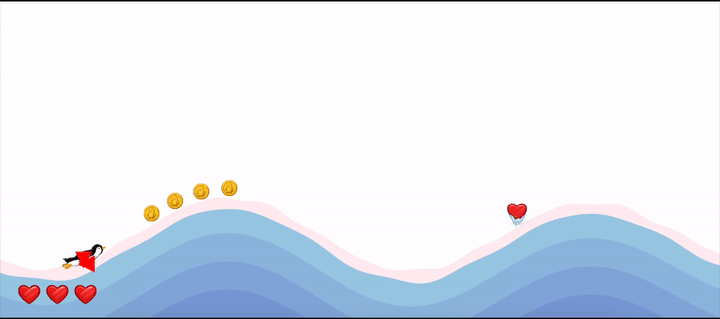
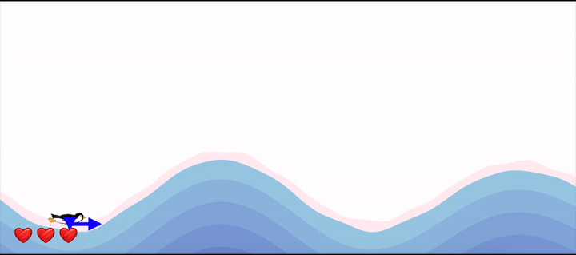
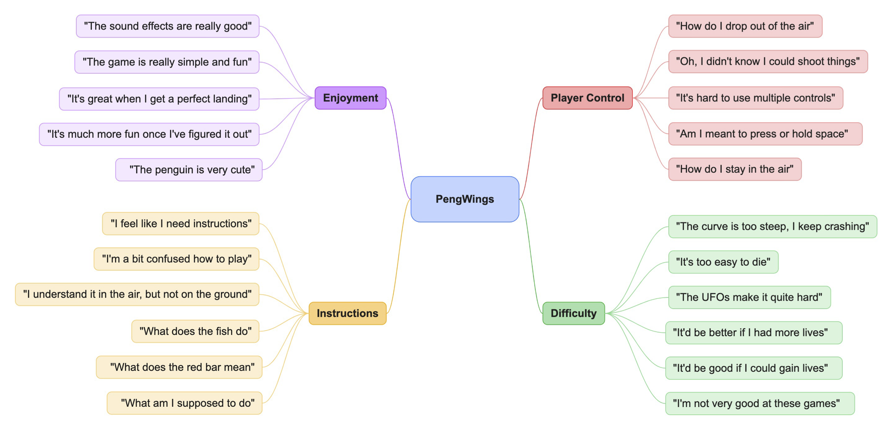
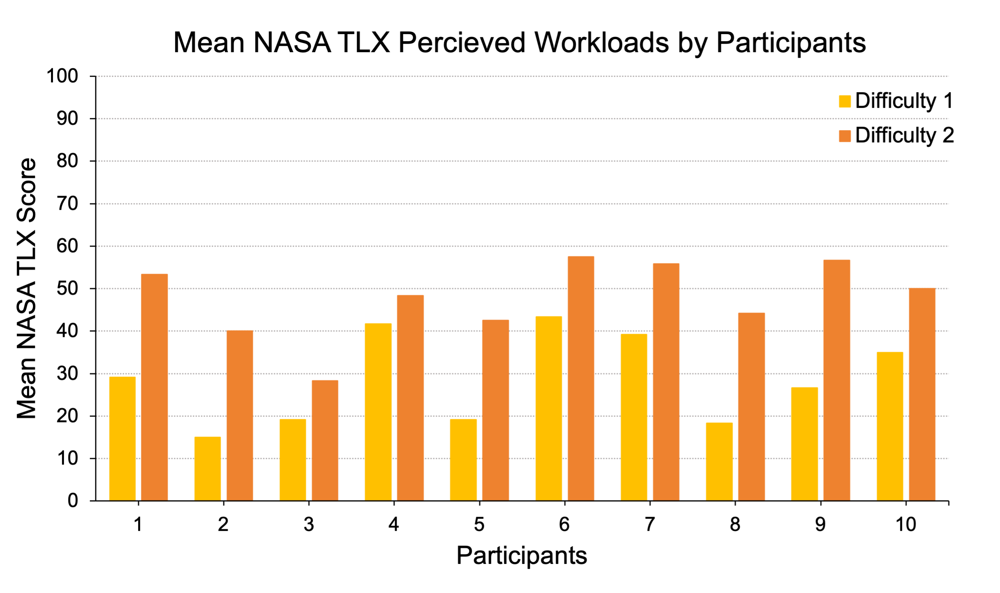
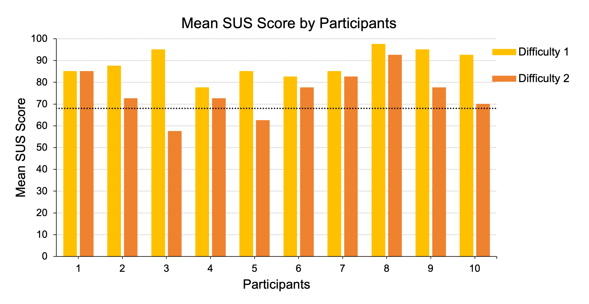

    
    

    
🐧&nbsp;&nbsp;&nbsp;<a href="https://uob-comsm0166.github.io/2025-group-21/"><strong>CLICK HERE TO PLAY!</strong></a>&nbsp;&nbsp;&nbsp;🚀

# Table of Contents
1. [Development Team](#1-development-team)
2. [Introduction](#2-introduction)
3. [Requirements](#3-requirements)
4. [Design](#4-design)
5. [Implementation](#5-implementation)
6. [Evaluation](#6-evaluation)
7. [Sustainability](#7-sustainability)
8. [Process](#8-process)
9. [Conclusion](#9-conclusion)
10. [Contribution Statement](#10-contribution-statement)

# 1. Development Team

    
    

| Name | Email | Primary Roles |
| :-: | :-: | :-: |
| Jack May | jack.robert.may@gmail.com | Backend, mechanics, API integration |
| Tom Raynes | nc19537@bristol.ac.uk | Full Stack, mechanics, sound design |
| Kuan Jung Huang | jp24328@bristol.ac.uk | Frontend, project management |
| Nicolas Esgeb | nico.esgeb.2024@bristol.ac.uk | Frontend, game art |
| Jing Yao | so24769@bristol.ac.uk | Frontend, graphic design |
| Zhiling Liu | cj24646@bristol.ac.uk | Frontend, UI design |

# 2. Introduction

PengWings is a browser-based, single-player arcade game. It’s source code is predominantly written in JavaScript, utilising the p5.js library. The game’s premise is that the player controls a penguin character with the objective of smoothly sliding down and over icy hills of varying size to gain airtime. The player must dodge and shoot down obstacles in order to increase their score and earn in-game currency. With these earned coins, the player can progress by upgrading various abilities allowing them to improve their performance and achieve a higher score. If the player achieves an all-time top ten score, their username is shown on the global leader board.

Partially inspired by the late-2000s flash game ‘Learn To Fly’, it is from here that PengWings draws many of it’s themes, namely ability upgrades and the objective of maximising the penguin’s airtime; however, our game introduces various twists that, we believe, advance the game’s replayability and overall user experience.

First and foremost, while the Learn To Fly gameplay is formed of a single predetermined jump from which the score is calculated, our game is composed of unique and infinitely generating terrain. This has the effect of creating a more engaging experience since each PengWings game will be different from the last.

PengWings also introduces obstacles (seagulls, planes and UFOs) which the player must either dodge or shoot down with their upgradable projectile ability. Making for a significantly more interactive experience, this becomes especially impactful as the player progresses through upgrades and observes new captivating and satisfying animations, encouraging user retention.

Along with many more of our own features such as saving progress, customising game preferences and a global leader board, we believe that PengWings offers an exhilarating and user-friendly experience to players of all ability levels. We hope that our game can be enjoyed by all.

### Item Table
<table>
  <thead>
    <tr>
      <th>Category</th>
      <th>Name</th>
      <th>Image</th>
      <th>Description</th>
    </tr>
  </thead>
  <tbody>
    <!-- Projectile-->
    <tr>
      <td rowspan="5">Projectile</td>
      <td>Level 1: Fish</td>
      <td></td>
      <td>Launches a flopping fish that deals small splash damage.</td>
    </tr>
    <tr>
      <td>Level 2: Snowball Cannon</td>
      <td></td>
      <td>Better collision knock back.</td>
    </tr>
    <tr>
      <td>Level 3: Arrow</td>
      <td></td>
      <td>Improved path clearance,shoot in a straight line.</td>
    </tr>
    <tr>
      <td>Level 4: Laser</td>
      <td></td>
      <td>Increased projectile speed.Explosion upon collision.</td>
    </tr>
    <tr>
      <td>Level 5: Automatic Laser</td>
      <td></td>
      <td>Wow!Shoot Laser from a Gatling gun!</td>
    </tr>
    <!-- Flying-->
    <tr>
      <td rowspan="5">Flying Ability</td>
      <td>Level 1: Normal mode</td>
      <td></td>
      <td>Basic mode.</td>
    </tr>
    <tr>
      <td>Level 2: Wing Enhancement</td>
      <td></td>
      <td>Smooth gliding.</td>
    </tr>
    <tr>
      <td>Level 3: Dragon Wings</td>
      <td></td>
      <td>Improved glide disctance and control.</td>
    </tr>
    <tr>
      <td>Level 4: Rotors</td>
      <td></td>
      <td>Allows hovering and precise movement.</td>
    </tr>
    <tr>
      <td>Level 5: Booster</td>
      <td></td>
      <td>High-speed propulsion for fast flight.</td>
    </tr>
    <tr>
      <td rowspan="1">Force field</td>
      <td>Force Field</td>
      <td></td>
      <td>force field protects players from collisions.</td>
    </tr>
    <tr>
      <td rowspan="3">Obstacles</td>
            <td>birds</td>
      <td></td>
      <td>...War between BIRDS!</td>
    </tr>
    <tr>
      <td>planes</td>
      <td></td>
      <td>To be a penguinator...or a bombguin!</td>
    </tr>
    <tr>
      <td>UFOs</td>
      <td></td>
      <td>Aliens...trembling!It's a Guinvasion...</td>
    </tr>
    <tr>
      <td rowspan="2">Collectibles</td>
      <td>hearts</td>
      <td></td>
      <td>Collect hearts to restore life.</td>
    </tr>
    <tr>
      <td>coins</td>
      <td></td>
      <td>Collect coins to upgrade your equipment in Workshop.</td>
    </tr>
</tbody>
</table>

# 3. Requirements 
### Ideation Processing

During the first week of our game development project, our team of six engaged in an ideation session to generate and refine potential game ideas. Prior to our group discussion, each member independently brainstormed one to two initial concepts based on their personal interests, gaming experiences, and feasibility considerations. After preparing their concepts, team members presented them in our session, where we collectively discussed each idea in detail.

In our meeting, each member shared their concepts. These proposed ideas spanned different genres, with a focus on game inspirations, fundamentals, and possible twists to ensure a diverse set of possibilities. We encouraged open discussion, asking questions, providing constructive feedback, and considering the difficulty level of each idea and how each idea aligned with our team's skills.

Through voting and discussions, we shortlisted a few promising concepts that best fit our team’s capabilities and goals. We used Miro to organize the results of our brainstorming.

<b>Table 1</b>

<i>Team Game Idea Overview</i>

| **Game Type**      | **Game Inspiration**        | **Game Description**                                         | **Possible Game Twists**                                     |
| ------------------ | --------------------------- | ------------------------------------------------------------ | ------------------------------------------------------------ |
| Role-Playing Game  | Inscryption Pokemon      | A strategic maze-based game where players navigate procedurally generated levels, interact with NPCs, and utilize a card-based system to solve puzzles or overcome obstacles. | Multiplayer mode High score system                        |
| Shooting Game      | Diep.io                     | A top-down shooter where players control a tank, engaging in battles while upgrading their arsenal and maneuvering through dynamic battlefields. | Multiple game modes Multiplayer mode High score system |
| Act Adventure Game | Super Mario                 | A side-scrolling platformer featuring generated maps, gravity-based physics, and interactive characters navigating through various levels. | High score system                                            |
| Action Game        | Skywire                     | A physics-based rollercoaster simulation where players design or navigate tracks, accounting for friction and gravity while avoiding obstacles. | Increasing difficulty Numerous levels High score system |
| Action Game        | Doodle Jump                 | A vertically scrolling game where players jump higher by bouncing on platforms, avoiding traps, and collecting power-ups. | Increasing difficulty Adding enemies, traps and interactive elements |
| Racing Game        | Happy wheels Motocross 3 | A physics-based motorbike game focusing on dynamic movement and precise rotation across multiple challenging levels. | Item upgrade system Interactive elements High score system |
| Simulation Game    | Into Space                  | A spaceflight game where players launch and control a rocket, adjusting for gravity, air resistance, and weather conditions while upgrading their craft. | Infinite map generation High score system                 |

<b>Figure 1</b>

<i>Brainstormed Game Ideas on Miro</i>

    

 

After brainstorming various game concepts, our team became particularly interested in physics-based mechanics, especially gravity. We decided to merge action and simulation elements, leading us to focus on the *Rocket Game*. Further research into space and flight-based games led Jack to discover a game called *Learn to Fly*, a game integrating gravity, air resistance, and propulsion. Inspired by its mechanics—and the idea that penguins are the only birds that cannot fly, making it our mission to help them take flight—we unanimously embraced this concept and included it as one of our final choices.

<b>Figure 2</b>

<i>Learn to Fly game animation</i>

    

### Prototype
In Shop Three, we created paper prototypes for *Rocket Game* and *Penguin Game*, which helped us visualize and test early game mechanics, including gravity, propulsion, and player interaction. Based on initial discussions, we made changes and added new elements to the game flow and format to enhance the fun of the gameplay. We also received feedback from our instructor and other teams, which gave us further insights into development challenges and market preferences. To facilitate clearer communication, we created simple animations simulating the paper prototype style, vividly showcasing the game flow and promoting better understanding and discussion within the team. These tools proved crucial for the development process moving forward.

<b>Figure 3</b>

<i>Paper Prototype of Rocket Game and Penguin Game</i>

    

 

    

### Digital Paper Prototype tool

To help people better understand the concept of the game, we also created a digital prototype. Jing attempted to generate the digital prototype using her iPad, which is closer to the actual game visuals compared to the paper prototype. 

**Additionally, it introduced a visual representation of the relationship between the space key operation and the penguin's movement.**

<b>Figure 4</b>

<i>Digital Paper Prototype Tool.</i>

    

 

<b>Figure 5</b>

<i>GameOver.</i>

    

 

### Feasibility Studies
Before starting the development process, we studied various representative game 
types and their core elements, reaching a consensus: we wanted to incorporate 
**physics-based elements**, such as gravity. Our research helped verify that these 
ideas were feasible. For example, players could alter the in-game gravity value 
by holding the space bar, allowing them to accelerate and take off from an upward slope.

To better illustrate our concept, we created a [paper prototype](#prototype) and encouraged 
players to try out our game demo. This allowed us to gather valuable feedback. However,
after testing our prototype, some users found it unclear how to effectively control acceleration. 
They also questioned the conditions under which the game would end, highlighting the need 
for clearer rules and better feedback mechanisms.

To address these concerns, we explored different ways to improve player understanding. 
One suggestion was to add cracks between the glaciers where the penguin could fall, 
introducing an additional challenge. Another improvement was to adjust the zoom levels, 
as users found the zoom-out effect too wide, making it harder to track the penguin's movement.

For game balancing, we considered setting a maximum gravity cap to prevent 
unintended gameplay issues. Additionally, we decided that difficulty should 
progressively increase, with obstacles appearing both on the ground and in the air.

Given that we had previously designed an in-game store, we refined and upgraded the store’s items—such as flight-related props that provide acceleration—based on player feedback to enhance the gaming experience.

External feedback also drew comparisons between our concept and existing physics-based movement games. Additionally, in our game, players must carefully maneuver along icy slopes, using acceleration and timing to launch into the air. The terrain itself becomes a key element of gameplay, making precise movement a challenge. Many players pointed out that our game mechanics were highly unique, strengthening our belief that it has the potential to provide an engaging and distinctive gameplay experience.

### Identifying Stakeholders

The stakeholder diagram illustrates the character system for the project, clearly identifying who is involved and their roles. Before implementation begins, it is crucial to understand the key stakeholders, including the development team, academics, and the instructor, as well as the end-users--our primary target audience: the players.

Using the hierarchy of the onion model, we can see that every feature we develop aims to meet the needs of our target audience. Additionally, successful project delivery requires close collaboration with the development team and alignment with the guidance of the instructor and academics. By maintaining effective communication and progress tracking, we can ensure that the project meets all requirements and launches the first version of the game on schedule.

<b>Figure 6</b>

<i>Onion Model of Learn To Fly Game</i>

  

### Persona

For a brandnew product, it is essential to prioritize target audiences, allowing us to focus on the highest-priority users when developing features for the initial game version. Personas are fictional yet research-based archetypes of our target users. They help the team better understand who our users are, their needs, and their behaviors. This shared understanding is vital for the development team, ensuring everyone is aligned and working towards the same goal. By clearly defining personas, we can make informed design and development decisions that resonate with our users.
 
| **Figure 7** _Persona 1._  | **Figure 8** _Persona 2._  | **Figure 9** _Persona 3._  |
|--|--|--|
 

### Identifying Top-Level Needs with User Stories

Once the personas are established, user stories are created to represent the needs, and challenges of each user type. By grounding user stories in the personas, we ensure that the product's functionality aligns with user expectations, resulting in a more user-centered design and a better overall experience.

<b>Table 2</b>

<i>User Story</i>

<table border="1" cellspacing="0" cellpadding="8">
    <tr>
        <th>User</th>
        <th>Epic</th>
        <th>User Stories</th>
        <th>Acceptance Criteria</th>
    </tr>
    <tr>
        <td rowspan="3">Casual Player</td>
        <td rowspan="3">Beginner-Friendly User Experience</td>
        <td>As a casual player, I want a simple and intuitive game so that I can have fun without spending a lot of time learning how to play.</td>
        <td>The game should have minimal controls and simple rules to ensure ease of play.</td>
    </tr>
    <tr>
        <td>As a casual player, I want a clear and simple tutorial on my first attempt so that I can quickly learn how to play the game.</td>
        <td>When entering the game for the first time, I should see an introductory tutorial explaining the basic controls and gameplay mechanics.</td>
    </tr>
    <tr>
        <td>As a casual player, I want to pause the game and resume later so that I can play at my own pace.</td>
        <td>I can click a “Pause” button to stop the game and a “Resume” button to continue from where I left off.</td>
    </tr>
    <tr>
        <td rowspan="5">Avid Player</td>
        <td>Replayability</td>
        <td>As an avid player, I want to replay the game so that I can improve my skills and achieve a sense of accomplishment.</td>
        <td>The game should allow multiple playthroughs without significant restrictions.</td>
    </tr>
    <tr>
        <td rowspan="2">Character Upgrades</td>
        <td>As an avid player, I want to upgrade my character’s gear so that I have a better chance of progressing to the next level.</td>
        <td>Players can access a shop before, during, and after the game to purchase tools and outfits using in-game currency.</td>
    </tr>
    <tr>
        <td>As an avid player, I want to earn rewards for upgrading my gear to stay competitive.</td>
        <td>Successfully upgraded gear should provide gameplay advantages and be visually distinct.</td>
    </tr>
    <tr>
        <td rowspan="2">Ranking System</td>
        <td>As an avid player, I want to see the highest scores recorded so that I can compete for the top spot.</td>
        <td>The main game page should display a real-time leaderboard showing the top 10 players.</td>
    </tr>
    <tr>
        <td>As an avid player, I want to compare my scores with friends.</td>
        <td>The game should include a friend leaderboard feature for score comparison.</td>
    </tr>

</table>

### Use-Cases Breakdown

Before designing the use-case diagram, we analyzed the stakeholders and user stories to ensure that all relevant interactions within the game system were captured. By breaking down the different needs and expectations of stakeholders, we structured the use-case diagram to accurately reflect player interactions and system functionalities.

<b>Figure 10</b>

<i>Use-case Diagram</i>

    

 

As this is a game design project, our primary stakeholder is the **Player**. The core interactions focus on how the player progresses from entering the game, navigating menus, engaging in gameplay, and upgrading abilities in the shop. The system ensures an immersive and rewarding experience across these stages.

<b>Figure 11</b>

<i>Use-case Specification</i>

    

# 4. Design

## Initial Design

Now, with a set of requirements in mind, it came time to begin designing our game architecture. We initially came up with a rough plan of the core modules that would be required, allowing us to work on individual components separately. This initial design is illustrated in the class diagram below (Figure 11).

    
    
<b>Figure 11.</b> Initial design class diagram

The main class would begin by instantiating the inventory which would persist throughout runtime. This class would hold all data relating to the in-game progress of the user such as ability levels and in-game currency. The game and shop classes would then be instantiated and destroyed as the user navigates between these two domains. Additionally, they would both need to interface with the inventory class as to allow for the relevant upgrades to be shown in the shop and for these upgrades to be used in the game.

The game class would be responsible for the actual gameplay. It would be formed of the following components:

&nbsp;&nbsp;&nbsp;&nbsp;&nbsp;&nbsp;&nbsp;<b>1. Terrain</b>

This class would generate a unique sinusoidal curve that would form the overall shape of the hills for a given game. It would be then responsible for drawing the updated terrain to the screen as the player moves through it. Moreover, the terrain class would contain methods that, given any x-coordinate, would return a y-coordinate corresponding to the ground height or the gradient of the slope at that position, which would be used by the player class to interact with the terrain.

&nbsp;&nbsp;&nbsp;&nbsp;&nbsp;&nbsp;&nbsp;<b>2. Player</b>

The player class would encapsulate all data and functionality relating to the player. This includes position and velocity data as well as methods handling the physics of the players motion while interacting with the terrain, e.g., calculating normal force, friction, and the transfer of vertical velocity from gravitation to horizontal velocity, preserving momentum.

&nbsp;&nbsp;&nbsp;&nbsp;&nbsp;&nbsp;&nbsp;<b>3. Death</b>

The general function of this class would be handling the sequence of events occurring at the point of game-over from either an obstacle collision or exceeding the normal force limit. The death class would be responsible for generating the game-over and coin reward animations as well as managing the internal state of a GUI allowing the user to play again or return to the shop.

&nbsp;&nbsp;&nbsp;&nbsp;&nbsp;&nbsp;&nbsp;<b>4. UFO / UFOHandler</b>

The UFOHandler class would be responsible for instantiating UFO objects and monitoring their positions. It would need to check if a collision between the player and a UFO has occurred as well ensure that any UFOs are destroyed if they travel off the screen. The UFO class would then encapsulate a UFO’s position/velocity data and functionality such as updating the position and drawing it on the screen.

&nbsp;&nbsp;&nbsp;&nbsp;&nbsp;&nbsp;&nbsp;<b>5. Laser / LaserAbility</b>

In much the same way as the previous pair of classes, the LaserAbility class would instantiate and monitor Laser objects. It would check for collisions between lasers and UFOs and destroy any off-screen lasers. Similarly, the Laser class would update the position and draw to the screen.

## Final Design

As new features were added throughout the development process, the system architecture underwent significant refactoring and structural changes. The final high-level architecture showing the overall program flow is illustrated in the class diagram (Figure 12) and sequence diagram (Figure 13) below.

    
    
<b>Figure 12.</b> Final design class diagram

    
    
<b>Figure 13.</b> Main sequence diagram

### Key Differences

Although this architecture is certainly object oriented in design, JavaScript itself is not a truly an object-oriented language at it’s core. Due to the nature of the p5 library’s setup() and draw() functions, it was found to be more desirable to substitute a Main class for a DomainManager class, instantiated once in the setup() function. This class is responsible for managing the execution of the main loops for all domains of the program which are navigable to the user.

Following the implementation of the load game feature, the instantiations of the inventory and settings classes were moved to inside the GameLoader class which initialises the states of these globally referenced classes to either the default state or the saved state depending on user input.

All sound assets are now loaded and cached during the instantiation of the SoundBoard class in the preload() function. During the instantiations of Game and Shop, the relevant sounds are retrieved from the SoundBoard cache by the constructors and assigned to temporary references inside these classes. The intent behind this design choice was for improved memory performance. By assigning cached sounds to temporary references, the garbage collector can more easily dispose of audio nodes since the disconnect() method can be called on the temporary references before switching domains. This change led to noticeably improved memory performance.

### Interactions within the Game class

A class diagram of all interactions in the Game class is shown below (Figure 14).

    
    
<b>Figure 14.</b> Final Game class diagram

Many new features were added to the game over the development process including new player abilities, a scoring system, pausing, a dynamic background, stats, collectables, lives, and a high score leader board. Some notable changes from our initial design worth discussing relate to the introduction of new in-game obstacles and projectiles.

The Laser and UFO classes from our initial design still exist; however, they are now concrete sub-classes of the abstract Projectile and AerialObstacle classes. The renamed ProjectileAbility and ObstacleHandler classes (formerly LaserAbility and UFOHandler), work in a similar way as before; however, they now store and update all projectiles and obstacles using polymorphic arrays, allowing for all Projectile and AerialObstacle sub-classes to be stored in the same data structure corresponding to their respective super-class, resulting in simplified code.

# 5. Implementation

## Challenges

While the game development was full of challenges and learning experiences, three particular instances of software development stood out to us.

### 1. Infinitely Generating the Map

A core requirement for our game was an infinite, randomly generated terrain. This epic involved three key requirements:

#### Endless Terrain Generation

We wanted the terrain to generate continuously as long as players stayed alive. While both Perlin noise and sine waves are common in procedural terrain generation, we chose sine waves for their smooth, rolling slopes, which better suited our visual style. By generating sine curves within the screen’s bounds and incrementally increasing the x-offset, we achieved endless terrain generation.

    
    
<b>Figure 1.</b> Evolution of our terrain generation over time.

#### Random and Unpredictable Terrain

To incorporate randomness, we combined multiple sine curves with varying amplitudes, frequencies, and phases. This summation created terrain with natural variation and unpredictability (see Figure 2). To ensure unique terrain for every session, we randomised the sine parameters using `Math.random()`.

    
    
<b>Figure 2.</b> Comparison of individual sine curves and their summed result.

#### Modifiable Difficulties

Difficulty levels were implemented by adjusting the sine wave parameters. More extreme values produce steeper, more chaotic terrain—ideal for skilled players seeking higher scores through greater airtime. Significant effort went into balancing these parameters to keep gameplay fun and challenging at all levels.

    
    
<b>Figure 3.</b> Terrain variations across different difficulty levels.

### 2. Movement Physics

A major design challenge was creating movement mechanics that felt both realistic and fun. Since players rely heavily on predicting how their character moves and interacts with the terrain, the physics needed to be intuitive and consistent.

#### Velocity

We based player movement on classical physics. The player has both position and velocity and acceleration vectors in the x and y directions.
- In the air, gravity increases the player's downward velocity.
- On the ground, friction slows the player's horizontal velocity.
- Our boost mechanic increases downward velocity mid-air and horizontal velocity on the ground.

These effects can be seen in the player’s velocity vectors in Figure 4a.

#### Acceleration

To simulate the acceleration and deceleration on the slopes, we used the physics of motion on an inclined plane:
 

    

 

These forces—shown in Figure 4b—formed the foundation of the players sliding mechanic. Using them, we fine-tuned bounce angles and collision responses. As with the terrain generation, we tweaked some of the real-world physics parameters to prioritise enjoyment over realism.

	

		
		
	

    	
<b>Figure 4.</b> Player velocity (A) and acceleration (B) vectors. Vector magnitudes scaled (velocity = 8, acceleration = 1500) for clarity.

### 3. Saving Progress and Global Leaderboards

#### Saving Progress

Since our game relies on accumulating progress over time, preserving the game state across sessions was essential. After evaluating options like cookies and server hosting, we chose client-side persistent storage using the Web Storage API. This approach allowed us to store and retrieve JSON data in the browser via a `SAVE_KEY`.

On each load, the game checks for this saved data. If present, it’s parsed and used to restore the previous game state. If the user opts to start fresh, default values overwrite the existing save. We stored a variety of parameters, including coins, purchased items, key bindings, volume, and difficulty settings.

#### Global Leaderboards

We also wanted a global leaderboard where players could compete across devices. Unlike progress data, this required shared access beyond the client’s browser. Our first solution used GitHub Gists—an easy, lightweight way to store username–score pairs. However, this raised two major issues:
- Authentication – Anyone with access to the front end could modify the public Gist, opening the door to fake scores.
- Race Conditions – Conflicts between read/write operations often resulting in lost scores.

To solve both issues, we set up Vercel serverless functions as our back end. This allowed us to securely handle game logic and validate score submissions on the server side. For persistent, real-time storage of high scores, we used Redis, a fast, in-memory data store well-suited for leaderboard-style JSON data.

# 6. Evaluation

## Qualitative Evaluation

To refine our game’s mechanics, difficulty, and overall level of enjoyment, we collected qualitative feedback through Think Aloud evaluations.

### Think Aloud

#### Process
Participants were asked to verbalise their thoughts and reactions during gameplay, which we recorded, focusing on moments of confusion and engagement with the game. From these records, we identified key themes, which we summarised and categorised in a thematic map (Figure 11).

	
	
<b>Figure X.</b> Thematic map of key Think Aloud evaluation feedback.

#### Solutions and Adjustments
Player Control:
- Issues: Difficulty understanding player movement mechanics and controls.
- Solutions: To address this feedback, we implemented an initial instructions page.

Instructions:
- Issues: Poor initial understanding of the gameplay, difficulty remembering the different features, and mixed feedback on the key mappings.
- Solutions: Added a brief instruction page before each game, and implemented custom key mappings to satisfy all player's preferences.

Difficulty:
- Issues: Players were unsure why they were losing health, found the terrain too steep, and the obstacles too challenging.
- Solutions: Added visible life indicators and audiovisual cues for taking damage, rebalanced the obstacles by incorporating tiers of enemies, and created three balanced difficulty levels.

## Quantitative Evaluation

To ensure our game was both appropriately challenging and also user-friendly, we conducted quantitative evaluations of usability using two established and validated questionnaire tools (ADD CITATIONS), and statistical analysis:
- **Raw NASA TLX** — to quantify perceived workload
- **System Usability Survey (SUS)** — to quantify system usability
- **Wilcoxon Signed-Rank Test** — to evaluate the statistical significance of the evaluations

#### Process
These evaluations involved 10 participants, each trialing two difficulty modes. Initially, participants struggled to grasp the gameplay, prompting us to add a short live demonstration. Participants then filled out the two questionnaires.

### Raw NASA TLX

#### Subscale Workload Scores
Across all six subscales, the median scores for all participants increased with difficulty. The largest change was in Frustration, which rose from a median of 20 (easy) to 55 (hard). Other sizeable increases were seen in Effort and Temporal Demand.

  
<b>Table X.</b> Median NASA TLX subscale scores for all participants.

  <table>
    <thead>
      <tr>
        <th>Scale</th>
        <th>Median (Easy)</th>
        <th>Median (Hard)</th>
        <th>Δ Median</th>
      </tr>
    </thead>
    <tbody>
      <tr><td>Mental Demand</td><td>20</td><td>40</td><td>+20</td></tr>
      <tr><td>Physical Demand</td><td>10</td><td>20</td><td>+10</td></tr>
      <tr><td>Temporal Demand</td><td>25</td><td>47.5</td><td>+22.5</td></tr>
      <tr><td>Frustration</td><td>20</td><td>55</td><td>+35</td></tr>
      <tr><td>Effort</td><td>35</td><td>60</td><td>+25</td></tr>
      <tr><td>Performance</td><td>55</td><td>75</td><td>+20</td></tr>
    </tbody>
  </table>

#### Overall Perceived Workload Scores
All participants reported an increased perceived workload at higher difficulty levels (Figure X). Learning effects were offset with alternating the difficulty testing order for each participant.

	
	
<b>Figure X.</b> Mean NASA TLX scores for each participant.

#### Statistical Analysis
A Wilcoxon Signed-Rank test was performed at both a subscale and overall level to ascertain the statistical significance of the change at a granular overarching level. The results (Table X) show that increasing difficulty gave a statistically significant difference in all scales except mental demand, and overall previewed workload.

  
<b>Table X.</b> Wilcoxon Signed-Rank Test, with N = 10, α = 0.05 and a critical value of 8.

  <table>
    <thead>
      <tr>
        <th>Scale</th>
        <th>W Test Statistic</th>
        <th>Critical Value</th>
        <th>Statistical Significance</th>
      </tr>
    </thead>
    <tbody>
      <tr><td>Mental Demand</td><td>11.5</td><td>8</td><td>No</td></tr>
      <tr><td>Physical Demand</td><td>3.5</td><td>8</td><td>Yes</td></tr>
      <tr><td>Temporal Demand</td><td>3</td><td>8</td><td>Yes</td></tr>
      <tr><td>Frustration</td><td>5.5</td><td>8</td><td>Yes</td></tr>
      <tr><td>Effort</td><td>0</td><td>8</td><td>Yes</td></tr>
      <tr><td>Performance</td><td>1</td><td>8</td><td>Yes</td></tr>
      <tr><td>Overall Perceived Workload</td><td>0</td><td>8</td><td>Yes</td></tr>
    </tbody>
  </table>

#### Solutions and Adjustments
Since the data show that higher difficulty led to significant increases in median frustration and effort, we made several design changes to maintain challenge without increasing frustration:
- Balanced terrain and obstacle difficulty.
- Improved the shop's upgradable items to help reduce player effort.
- Ensured that difficulty increases felt rewarding, not frustrating.

### System Usability Survey (SUS)

#### Process
After completing the NASA TLX, all 10 participants completed the SUS, which consists of 10 standardized questions assessing overall system usability. Scores were calculated using standard SUS methodology (Figure X).

#### Results
The individual SUS scores are shown in Figure X, with the industry average benchmark of 68 shown for comparison.
- Mean SUS score (Easy) — 88.25
- Mean SUS score (Hard) — 75.0

	
	
<b>Figure X.</b> Mean SUS scores for each participant.

While two participants rated the harder difficulty below average usability, overall scores remained well above the standard usability benchmark. This suggests that our game had excellent usability even at a higher difficulty level.

#### Statistical Analysis
A Wilcoxon Signed-Rank test was performed on the SUS scores for both difficulties. The critical value was 8 (N = 10, α = 0.05), and the W Test statistic was calculated to be 0, indicating that there was a statistically significant difference between usability at different difficulty.

#### Solutions and Adjustments
While the SUS confirmed high usability, we found it less applicable than our qualitative and NASA TLX evaluations for informing design changes. Nonetheless, it served as a valuable confirmation of our game’s overall user experience. We noted potential questionnaire fatigue due to administering the SUS immediately after the NASA TLX, which may have affected response quality. In future iterations, we would schedule breaks or separate the two evaluations.

## Testing

### White Box Testing
We used Jest unit testing to verify our game code’s logic, focusing on game states, ensuring that triggering functions produced expected changes in the game state. Due to the game’s complexity, this was quite a difficult step, so we concentrated on testing the classes and methods that controlled the players movements, control, and interactions, as these were the most likely to hinder user’s game play.

**Example — Obstacle Testing** 
Our game aerial obstacles, intended to challenge the player while flying. We tested their movement and interactions with the player using a range of assertions. This was aided by using the inheritance and polymorphism in the obstacle subclasses. An excerpt is shown below.

	[ADD OBSTACLE TESTING CODE HERE]

### Black Box Testing
We conducted extensive black box testing throughout development. A develop branch allowed us to merge updates and test repeatedly, identifying bugs before deploying the code on the main branch.

# 7. Sustainability 

To incorporate sustainability into our development process, we utilised two protocols:
- Sustainability Awareness Framework (SusAF)
- And, the Green Software Foundation Design Patterns

### Sustainability Awareness Framework

#### Questions and Discussion

As a team, we each contributed sustainability-focused questions to prompt group discussion. This process challenged us to reflect on our sustainability assumptions, and to think critically about how we addressed similar questions from others. These questions and discussions centred around the five dimensions of sustainability.

#### Analysis

From this open discussion, we created a framework of notes, that divides the sustainability impacts of our game into focal points within these five dimensions (Table X).

  
<b>Table X.</b> Discussion notes divided into sustainability dimensions from SusAF protocol.

  <table border="1">
    <thead>
      <tr>
        <th>Dimension</th>
        <th>Aspect</th>
        <th>Description</th>
      </tr>
    </thead>
    <tbody>
      <tr><td rowspan="4">Social</td><td>Sense of community</td><td>The leaderboard feature encourages friendly competition, building the games community.</td></tr>
      <tr><td>Trust</td><td>Regular updates and improvements show a commitment to quality, building user trust.</td></tr>
      <tr><td>Equity</td><td>Progression is merit-based, not monetarily, giving all users equal opportunities to progress.</td></tr>
      <tr><td>Participation</td><td>Proposed cooperative play will aid this.</td></tr>
      <tr><td rowspan="4">Individual</td><td>Health</td><td>Complete keyboard accessibility allows users with impaired mobility to access the game.</td></tr>
      <tr><td>Privacy</td><td>Usernames protect users identities, reducing privacy concerns.</td></tr>
      <tr><td>Safety</td><td>Prompting users to not provide any identifiable details to the game to ensure privacy.</td></tr>
      <tr><td>Agency</td><td>Users can control participation and provide feedback.</td></tr>
      <tr><td rowspan="4">Environmental</td><td>Material and resources</td><td>Development process unfortunately consumes resources and time.</td></tr>
      <tr><td>Waste & pollution</td><td>Streamlining development and avoiding unnecessary work.</td></tr>
      <tr><td>Biodiversity</td><td>Energy and memory usage negatively impact the environment, and should be minimised.</td></tr>
      <tr><td>Energy</td><td>Code optimisation reduces energy and memory demands.</td></tr>
      <tr><td rowspan="3">Economic</td><td>Value</td><td>Organic growth through user sharing. Paid upgrades proposed for keen fans.</td></tr>
      <tr><td>Customer Relationship Management</td><td>Fair reward systems helps build trust. Monetization will be balanced and user-friendly.</td></tr>
      <tr><td>Supply Chain</td><td>Reliance on GitHub hosting and cloud based backend.</td></tr>
      <tr><td rowspan="5">Technical</td><td>Maintainability</td><td>Ongoing updates help maintain and keep the game operational.</td></tr>
      <tr><td>Usability</td><td>Accessible and usable for a range of users, evaluated qualitatively and quantitatively.</td></tr>
      <tr><td>Adaptability</td><td>A modular OO design supports expansion of the code.</td></tr>
      <tr><td>Security</td><td>Minimal data collection and storage in a secure backend database protect privacy.</td></tr>
      <tr><td>Scalability</td><td>Serverless backend model allows for green and easy user base scaling.</td></tr>
    </tbody>
  </table>

We attempted to arrange these into short, medium and long-term effects, and visualised them using a SusA diagram. This process was invaluable in helping us adopt a more sustainability thoughtful approach, and consider a broader range of longer term impacts.

	[ ADD SUS DIAGRAM HERE}

Figure X. …..

#### Sustainability in Design

By using these two protocols, we were able to make informed and accurate decisions sustainability during our development. The insights gathered during this process were used to develop a series of user stories (Table X), which we translated into actionable requirements in our product backlog.

  
<b>Table X.</b> Sustainability user stories and their acceptance criteria, arising from the SusAF.

  <table border="1" cellspacing="0" cellpadding="8">
    <tr>
        <th>User</th>
        <th>Epic</th>
        <th>User Stories</th>
        <th>Acceptance Criteria</th>
    </tr>
    <tr>
        <td rowspan="9">Sustainable Design</td>
        <td rowspan="2">Technical</td>
        <td>As an avid player, I want to play this game for a long time and maintain my progress and high scores.</td>
        <td>The high-score data storage should be persistent and maintained.</td>
    </tr>
    <tr>
        <td>As an avid player, I want to be able to see and learn from the code bases of the games I play.</td>
        <td>The open-source code should be maintained and accessible.</td>
    </tr>
    <tr>
        <td rowspan="2">Social</td>
        <td>As a casual player, I want a game that doesn't become too addictive over time and doesn't take up too much of my life.</td>
        <td>The game should have clear milestones and reasonable progress that isn't too demanding.</td>
    </tr>
    <tr>
        <td>As a casual player, I want a good balance of competitiveness, without having to spend too much time to stay on top.</td>
        <td>The game should reward players of all skill levels, and not skew too heavily towards better players.</td>
    </tr>
    <tr>
        <td rowspan="2">Economic</td>
        <td>As a casual player, I want to play free games, so I don't feel I have to pay to be good at the game.</td>
        <td>The game should be free and fun with any costs only being for avid players.</td>
    </tr>
    <tr>
        <td>As a casual player, I want to be able to just connect to the internet and be able to play.</td>
        <td>The game should be accessible on a web browser without anything extra required.</td>
    </tr>
    <tr>
        <td rowspan="1">Environmental</td>
        <td>As an avid player, I want a game that feels representative of my interests.</td>
        <td>The game should feel grounded in its environment.</td>
    </tr>
    <tr>
        <td rowspan="2">Individual</td>
        <td>As a casual player, I want a game that doesn't require my data or is a safety risk.</td>
        <td>The game should not require any important data from the users, to make the games' data usage sustainable.</td>
    </tr>
    <tr>
        <td>As a casual player, I don't want to feel addicted or in pain after playing for periods of time.</td>
        <td>The game should have comfortable controls and mechanics, and not heavily reward prolonged playtime.</td>
    </tr>
  </table>

### Green Software Foundation Patterns

To support the sustainability of our game, we researched a range of Green Software Patterns, and selected three patterns we felt were relevant and impact to our development. (citation X) We evaluated their effectiveness against the Software Carbon Intensity (SCI) equation `SCI = (E * I) + M per R`.

#### 1. Defer Offscreen Images

While this pattern is traditionally related to lazy loading of web assets, we found it highly applicable to our games design. Given that our game works by continuously generating visual elements, including terrain, obstacles and collectibles, it was necessary to instantiate only what’s necessary on screen. Otherwise, we risked excessive CPU and memory use. Our game is programmed to only load visual elements they become visible, and quickly removes them once off screen. 

For instance, aerial obstacles are not preloaded fro a large array. Instead, their spawn chance is repeatedly evaluated, and they are instantiated only while on screen. This on-demand asset loading helps to reduce rendering and memory use, lowering client-side energy usage (E) in the SCI equation.

#### 2. Use Serverless Cloud Services

Our game required a backend system to manage and store high scores, shared between users. We saw an opportunity to apply an impactful Green Software Pattern, to maximise our sustainability. We chose to use Vercel for it’s API functions, and Redis Cloud for data storage, both of which use serverless models.

Vercel allowed us to deploy APIs that submit and retrieve high scores via on-demand serverless functions. This approach ensures no resources are consumed when the game isn’t being played, helping reduce our carbon intensity (I) as a factor of the SCI equation. Similarly, Redis Cloud’s serverless infrastructure allows it to dynamically scale and share its hardware based on demand, efficiently allocating memory and reducing the embodied carbon (M) as a factor in the SCI equation.

#### 3. Cache Static Data

A third Green Software Pattern we incorporated was to cache static data into memory, specifically sound assets. PengWings uses a range of sound affects and music. We found repeatedly loading them created significant and unsustainable memory use, which we observed in the sound buffer in the browser. 

We chose to use a caching system to address this, which allowed the sounds to be cached in a SoundBoard class. This made them easily accessible, minimised redundant loading, and allowed for easy dereferencing when the assets were no longer required— by prompting the JavaScript garbage collection to remove them from memory storage. By reducing the repeated data loading and memory use, this helped to reduce our total electricity (E) factor of the SCI equation.

# 8. Process 

## Collaboration

Over the course of the project, our team adopted an agile development methodology to manage tasks. We participated both in online and in-person collaboration, maintaining regular communication as to maximise our efficiency. At the project’s conception, we agreed upon a flat team structure in which all members contributed equally to decision-making while delegating member-specific tasks based on the strengths of the individual. This approach enabled us to capitalise on the diverse range of skills between us, while maintaining shared accountability for the project’s overall progress.

To keep development on track, we maintained a consistent weekly routine. During term time, we used Tuesday’s workshop sessions to collaborate on in-class tasks and held in-person meetings on Fridays to reflect on the week’s work, showcase progress/new features, and discuss our next steps as well as areas for improvement. Notes from these meetings can be found in the `/meetings` directory.

    

        
        
Team work in workshops

    

    

        
        
Footage from a team meeting

    

Commencing the Easter holiday period, we transitioned to a remote setup. We held weekly Wednesday meetings, online, over Google Meet. Similarly, this time was used to share progress updates, identify and discuss blockers, and discuss feedback from peer testing.

Throughout development, we completed two sprint cycles with each lasting two weeks. Each sprint began with a planning session where the team reviewed the Product Backlog, identified high-priority user stories, and agreed upon strategies to satisfy them. Miro was central to our planning process; we used it to create visual boards that made responsibilities and task breakdowns clear and understandable to everyone.

    
    
Sprint planning

In order to estimate task difficulty and plan effectively, we used the Planning Poker method, which gave us a good balance between accuracy and team discussion. When assigning tasks, we considered each person’s strengths, how much time could realistically be committed, and any dependencies or technical challenges that may arise. We also considered which features would have the most impact on gameplay with the MoSCoW user story framework, focusing on what mattered most.

During sprints, we tracked progress using Kanban, dividing tasks into “To Do,” “In Progress,” and “Done.” Kanban tickets were updated regularly, allow us to easily monitor the progression of our game and spot issues early.

    
    
Screenshot of our group's Kanban

Concluding each sprint, we completed a sprint review and retrospective. Team members presented their progress, whether it may be a new game mechanic, interface updates, or documentation improvements. We discussed whether progress had fulfilled our acceptance criteria as well as the next steps for our game, referring to our product backlog. Following this, we then discussed what went well, what didn’t, and how we could work better in the next sprint. General issues we encountered included code merge conflicts, overlapping work on the same feature, and delays in testing; however, we were always able to work through these issues with open dialogue and devise practical solutions.

    
    
Short recording from a sprint review

## Tools

To support communication, planning, documentation, and our needs throughout development, we used a range of tools. These include:

**Miro**  
- Used in the early brainstorming phase and throughout the project for sprint planning and visual task mapping. Its Planning Poker feature also supported our task estimation process.

**Microsoft Word**  
- Used collaboratively to edit documents reasons such as updating requirements, documenting evaluation data, and sustainability analyses.

**Google Meet**  
- Our primary tool for online meetings during the holiday period.

**WhatsApp**  
- Used for day-to-day team communication.

**Kanban**  
- Used for product backlog management and visually tracking our progress.

**Photoshop**  
- Used within the graphic design process to easily create graphic material for the game, demo video, and repo.

**Logic Pro X**  
- Used throughout the project for sound engineering purposes.

## Reflection

### Successes

- Visual tools (Miro/prototypes) effectively aligned team understanding in early stages
- Balanced task allocation with Kanban kept everyone involved and enabled clear progress tracking.
- Open communication channels accelerated technical problem-solving
- Git branching and GitHub pull request workflows maintained a stable codebase
- Kanban implementation enabled clear progress tracking
- Frequent user testing outside the team helped prioritize what to improve.
- A comprehensive documentation system enabled rapid task onboarding.

### Problems

- A recurring challenge was code integration. As some members co-developed overlapping modules, we sometimes had disagreements on how to merge changes. This was overcome through discussion in the review process, diagnosing the source of any conflicts to find the optimal solution for integration.
- In the very early phase of the project, the absence of a well-defined structure led to some duplicated work; however, this was soon solved as a more refined design was established.

# 9. Conclusion

The PengWings project has been a massive undertaking. From the beginning, our goals were ambitious, and we put our hearts and souls into making these ambitions a reality. Capitalising on the unique skillsets of each member, we, the PengWings team, have demonstrated that together we are greater than the sum of our parts, creating a game that, we believe, speaks for itself.

Throughout the project, we engaged in frequent sprint reviews/retrospectives, stand-ups, and planning meetings, conforming to an agile development paradigm to satisfy our requirements. The feedback we received from our initial user evaluations was invaluable, offering clear metrics by which we were able to improve upon our design/implementation and synthesise a significantly more user-friendly experience. With each team member working primarily from their respective development branch, we were able to specialise in the areas in which we each excelled and then combine our individual contributions into our main development branch. These methods proved to be very successful.

Despite the successes of our process, in hindsight, we could have benefitted from code reviews. With team members focusing on different aspects of the game, an issue we sometimes ran into was not initially being familiarised with the code of other members. Adopting code reviews would streamline the integration process, allowing for us write code that would fit together ‘out of the box’, rather than having to retroactively change things when merging.

Many challenges were overcome during the implementation process. From generating unique yet reliable terrain, to simulating the physics of player motion that is not only accurate but entertaining, to efficiently and safely storing high scores along with progress data, the knowledge and skills that we have acquired overcoming these challenges and throughout the project are invaluable and will be carried with us as we progress into our professional careers. Group projects can be hard, especially when team members come from a variety of academic backgrounds; however, by taking advantage of these differences, we were able to quickly find our team’s rhythm and bring our initial vision to fruition.

Despite having satisfied our acceptance criteria, it is important to recognise that PengWings is not perfect — All software can be improved! We have discussed countless ideas regarding our vision for the future of our game that, given time, could be implemented. Today more than ever, the preferred platform for arcade games like ours is mobile. Implementing support for mobile applications will be essential for increasing the reach of PengWings. Additionally, introducing new levels with alternate themes (e.g., desert, jungle) as well as new game modes (e.g., highest jump, obstacles downed in set time) will expand the diversity of gameplay, leading to greater user retention. Finally, adding support for multiplayer will be a gamechanger. Allowing for users to play with friends over a server will further increase appeal and encourage the growth of the PengWings community.

To conclude, we have found the PengWings project to be a deeply rewarding and enjoyable experience. Each team member has come out the other side as a stronger team player and more rounded developer. We are all extremely proud of what we have achieved, and we hope that the game we have created will continue to be played and loved into the future.

# 10. Contribution Statement

| Name | Contribution |
| :-: | :-: |
| Jack May | 1.00 |
| Tom Raynes | 1.00 |
| Kuan Jung Huang | 1.00 |
| Nicolas Esgeb | 1.00 |
| Jing Yao | 1.00 |
| Zhiling Liu | 1.00 |

Table showing the relative contributions to the PengWings project

