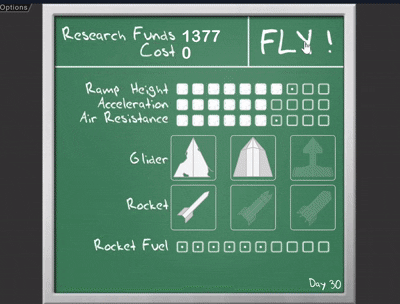
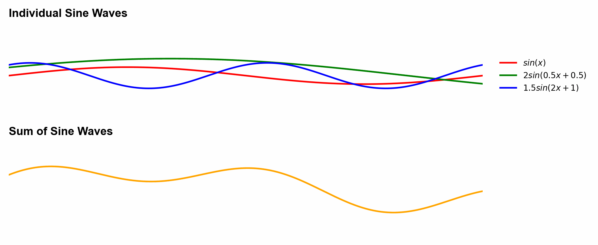
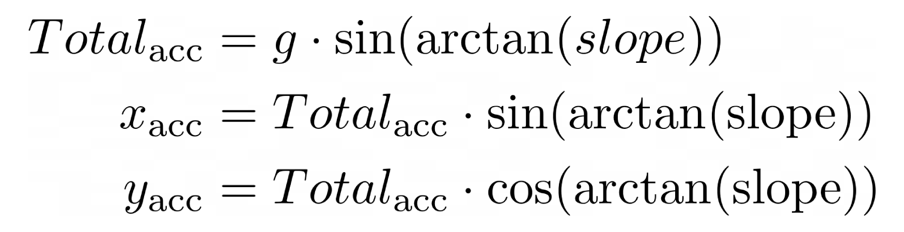
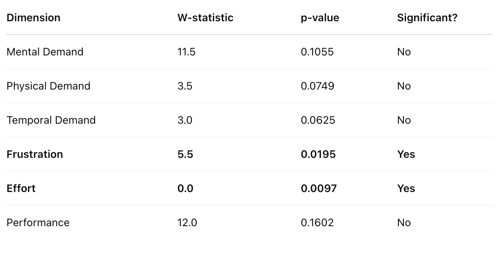

    
    

    
<a href="https://uob-comsm0166.github.io/2025-group-21/">🐧 Click me! You can play our game here! 🚀</a>

# Table of Contents
- [1. Development Team](#1-development-team)
- [2. Introduction](#2-introduction)
- [3. Requirements](#3-requirements)
- [4. Design](#4-design)
- [5. Implementation](#5-implementation)
- [6. Evaluation](#6-evaluation)
- [7. Sustainability](#7-sustainability)
- [8. Process](#8-process)
- [9. Conclusion](#9-conclusion)
- [10. References](#10-contribution-statement)
# 1. Development Team

| Group # | Name | Email | Role |
| :-: | :-: | :-: | :-: |
| 01 | Jack May | jack.robert.may@gmail.com | |
| 02 | Tom Raynes | nc19537@bristol.ac.uk | |
| 03 | Kuan Jung Huang | jp24328@bristol.ac.uk | |
| 04 | Nicolas Esgeb | nico.esgeb.2024@bristol.ac.uk | |
| 05 | Jing Yao | so24769@bristol.ac.uk | |
| 06 | Zhiling Liu | cj24646@bristol.ac.uk | |

# 2. Introduction

PengWings is a browser-based, single-player arcade game. It’s source code is predominantly written in JavaScript, utilising the p5.js library. The game’s premise is that the player controls a penguin character with the objective of smoothly sliding down and over icy hills of varying size to gain airtime. The player must dodge and shoot down obstacles in order to increase their score and earn in-game currency. With these earned coins, the player can progress by upgrading various abilities allowing them to improve their performance and achieve a higher score. If the player achieves an all-time top ten score, their username is shown on the global leader board.

Partially inspired by the late-2000s flash game ‘Learn To Fly’, it is from here that PengWings draws many of it’s themes, namely ability upgrades and the objective of maximising the penguin’s airtime; however, our game introduces various twists that, we believe, advance the game’s replayability and overall user experience.

First and foremost, while the Learn To Fly gameplay is formed of a single predetermined jump from which the score is calculated, our game is composed of unique and infinitely generating terrain. This has the effect of creating a more engaging experience since each PengWings game will be different from the last.

PengWings also introduces obstacles (seagulls, planes and UFOs) which the player must either dodge or shoot down with their upgradable projectile ability. Making for a significantly more interactive experience, this becomes especially impactful as the player progresses through upgrades and observes new captivating and satisfying animations, encouraging user retention.

Along with many more of our own features such as saving progress, customising game preferences and a global leader board, we believe that PengWings offers an exhilarating and user-friendly experience to players of all ability levels. We hope that our game can be enjoyed by all.

# 3. Requirements 
### Ideation Processing

During the first week of our game development project, our team of six engaged in an ideation session to generate and refine potential game ideas. Prior to our group discussion, each member independently brainstormed one to two initial concepts based on their personal interests, gaming experiences, and feasibility considerations. After preparing their concepts, team members presented them in our session, where we collectively discussed each idea in detail.

In our meeting, each member shared their concepts. These proposed ideas spanned different genres, with a focus on game inspirations, fundamentals, and possible twists to ensure a diverse set of possibilities. We encouraged open discussion, asking questions, providing constructive feedback, and considering the difficulty level of each idea and how each idea aligned with our team's skills.

Through voting and discussions, we shortlisted a few promising concepts that best fit our team’s capabilities and goals. We used Miro to organize the results of our brainstorming.

<b>Table 1</b>

<i>Team Game Idea Overview</i>

| **Game Type**      | **Game Inspiration**        | **Game Description**                                         | **Possible Game Twists**                                     |
| ------------------ | --------------------------- | ------------------------------------------------------------ | ------------------------------------------------------------ |
| Role-Playing Game  | Inscryption Pokemon      | A strategic maze-based game where players navigate procedurally generated levels, interact with NPCs, and utilize a card-based system to solve puzzles or overcome obstacles. | Multiplayer mode High score system                        |
| Shooting Game      | Diep.io                     | A top-down shooter where players control a tank, engaging in battles while upgrading their arsenal and maneuvering through dynamic battlefields. | Multiple game modes Multiplayer mode High score system |
| Act Adventure Game | Super Mario                 | A side-scrolling platformer featuring generated maps, gravity-based physics, and interactive characters navigating through various levels. | High score system                                            |
| Action Game        | Skywire                     | A physics-based rollercoaster simulation where players design or navigate tracks, accounting for friction and gravity while avoiding obstacles. | Increasing difficulty Numerous levels High score system |
| Action Game        | Doodle Jump                 | A vertically scrolling game where players jump higher by bouncing on platforms, avoiding traps, and collecting power-ups. | Increasing difficulty Adding enemies, traps and interactive elements |
| Racing Game        | Happy wheels Motocross 3 | A physics-based motorbike game focusing on dynamic movement and precise rotation across multiple challenging levels. | Item upgrade system Interactive elements High score system |
| Simulation Game    | Into Space                  | A spaceflight game where players launch and control a rocket, adjusting for gravity, air resistance, and weather conditions while upgrading their craft. | Infinite map generation High score system                 |

<b>Figure 1</b>

<i>Brainstormed Game Ideas on Miro</i>

    

 

After brainstorming various game concepts, our team became particularly interested in physics-based mechanics, especially gravity. We decided to merge action and simulation elements, leading us to focus on the *Rocket Game*. Further research into space and flight-based games led Jack to discover a game called *Learn to Fly*, a game integrating gravity, air resistance, and propulsion. Inspired by its mechanics—and the idea that penguins are the only birds that cannot fly, making it our mission to help them take flight—we unanimously embraced this concept and included it as one of our final choices.

<b>Figure 2</b>

<i>Learn to Fly game animation</i>

    

### Prototype
In Shop Three, we created paper prototypes for *Rocket Game* and *Penguin Game*, which helped us visualize and test early game mechanics, including gravity, propulsion, and player interaction. Based on initial discussions, we made changes and added new elements to the game flow and format to enhance the fun of the gameplay. We also received feedback from our instructor and other teams, which gave us further insights into development challenges and market preferences. To facilitate clearer communication, we created simple animations simulating the paper prototype style, vividly showcasing the game flow and promoting better understanding and discussion within the team. These tools proved crucial for the development process moving forward.

<b>Figure 3</b>

<i>Paper Prototype of Rocket Game and Penguin Game</i>

    

 

    

### Digital Paper Prototype tool

To help people better understand the concept of the game, we also created a digital prototype. Jing attempted to generate the digital prototype using her iPad, which is closer to the actual game visuals compared to the paper prototype. 

**Additionally, it introduced a visual representation of the relationship between the space key operation and the penguin's movement.**

<b>Figure 4</b>

<i>Digital Paper Prototype Tool.</i>

    

 

<b>Figure 5</b>

<i>GameOver.</i>

    

 

### Feasibility Studies
Before starting the development process, we studied various representative game 
types and their core elements, reaching a consensus: we wanted to incorporate 
**physics-based elements**, such as gravity. Our research helped verify that these 
ideas were feasible. For example, players could alter the in-game gravity value 
by holding the space bar, allowing them to accelerate and take off from an upward slope.

To better illustrate our concept, we created a [paper prototype](#prototype) and encouraged 
players to try out our game demo. This allowed us to gather valuable feedback. However,
after testing our prototype, some users found it unclear how to effectively control acceleration. 
They also questioned the conditions under which the game would end, highlighting the need 
for clearer rules and better feedback mechanisms.

To address these concerns, we explored different ways to improve player understanding. 
One suggestion was to add cracks between the glaciers where the penguin could fall, 
introducing an additional challenge. Another improvement was to adjust the zoom levels, 
as users found the zoom-out effect too wide, making it harder to track the penguin's movement.

For game balancing, we considered setting a maximum gravity cap to prevent 
unintended gameplay issues. Additionally, we decided that difficulty should 
progressively increase, with obstacles appearing both on the ground and in the air.

Given that we had previously designed an in-game store, we refined and upgraded the store’s items—such as flight-related props that provide acceleration—based on player feedback to enhance the gaming experience.

External feedback also drew comparisons between our concept and existing physics-based movement games. Additionally, in our game, players must carefully maneuver along icy slopes, using acceleration and timing to launch into the air. The terrain itself becomes a key element of gameplay, making precise movement a challenge. Many players pointed out that our game mechanics were highly unique, strengthening our belief that it has the potential to provide an engaging and distinctive gameplay experience.

### Identifying Stakeholders

The stakeholder diagram illustrates the character system for the project, clearly identifying who is involved and their roles. Before implementation begins, it is crucial to understand the key stakeholders, including the development team, academics, and the instructor, as well as the end-users--our primary target audience: the players.

Using the hierarchy of the onion model, we can see that every feature we develop aims to meet the needs of our target audience. Additionally, successful project delivery requires close collaboration with the development team and alignment with the guidance of the instructor and academics. By maintaining effective communication and progress tracking, we can ensure that the project meets all requirements and launches the first version of the game on schedule.

<b>Figure 6</b>

<i>Onion Model of Learn To Fly Game</i>

  

### Persona

For a brandnew product, it is essential to prioritize target audiences, allowing us to focus on the highest-priority users when developing features for the initial game version. Personas are fictional yet research-based archetypes of our target users. They help the team better understand who our users are, their needs, and their behaviors. This shared understanding is vital for the development team, ensuring everyone is aligned and working towards the same goal. By clearly defining personas, we can make informed design and development decisions that resonate with our users.
 
| **Figure 7** _Persona 1._  | **Figure 8** _Persona 2._  | **Figure 9** _Persona 3._  |
|--|--|--|
 

### Identifying Top-Level Needs with User Stories

Once the personas are established, user stories are created to represent the needs, and challenges of each user type. By grounding user stories in the personas, we ensure that the product's functionality aligns with user expectations, resulting in a more user-centered design and a better overall experience.

<b>Table 2</b>

<i>User Story</i>

<table border="1" cellspacing="0" cellpadding="8">
    <tr>
        <th>User</th>
        <th>Epic</th>
        <th>User Stories</th>
        <th>Acceptance Criteria</th>
    </tr>
    <tr>
        <td rowspan="3">Casual Player</td>
        <td rowspan="3">Beginner-Friendly User Experience</td>
        <td>As a casual player, I want a simple and intuitive game so that I can have fun without spending a lot of time learning how to play.</td>
        <td>The game should have minimal controls and simple rules to ensure ease of play.</td>
    </tr>
    <tr>
        <td>As a casual player, I want a clear and simple tutorial on my first attempt so that I can quickly learn how to play the game.</td>
        <td>When entering the game for the first time, I should see an introductory tutorial explaining the basic controls and gameplay mechanics.</td>
    </tr>
    <tr>
        <td>As a casual player, I want to pause the game and resume later so that I can play at my own pace.</td>
        <td>I can click a “Pause” button to stop the game and a “Resume” button to continue from where I left off.</td>
    </tr>
    <tr>
        <td rowspan="5">Avid Player</td>
        <td>Replayability</td>
        <td>As an avid player, I want to replay the game so that I can improve my skills and achieve a sense of accomplishment.</td>
        <td>The game should allow multiple playthroughs without significant restrictions.</td>
    </tr>
    <tr>
        <td rowspan="2">Character Upgrades</td>
        <td>As an avid player, I want to upgrade my character’s gear so that I have a better chance of progressing to the next level.</td>
        <td>Players can access a shop before, during, and after the game to purchase tools and outfits using in-game currency.</td>
    </tr>
    <tr>
        <td>As an avid player, I want to earn rewards for upgrading my gear to stay competitive.</td>
        <td>Successfully upgraded gear should provide gameplay advantages and be visually distinct.</td>
    </tr>
    <tr>
        <td rowspan="2">Ranking System</td>
        <td>As an avid player, I want to see the highest scores recorded so that I can compete for the top spot.</td>
        <td>The main game page should display a real-time leaderboard showing the top 10 players.</td>
    </tr>
    <tr>
        <td>As an avid player, I want to compare my scores with friends.</td>
        <td>The game should include a friend leaderboard feature for score comparison.</td>
    </tr>

</table>

### Use-Cases Breakdown

Before designing the use-case diagram, we analyzed the stakeholders and user stories to ensure that all relevant interactions within the game system were captured. By breaking down the different needs and expectations of stakeholders, we structured the use-case diagram to accurately reflect player interactions and system functionalities.

<b>Figure 10</b>

<i>use-case diagram</i>

    

 

As this is a game design project, our primary stakeholder is the **Player**. The core interactions focus on how the player progresses from entering the game, navigating menus, engaging in gameplay, and upgrading abilities in the shop. The system ensures an immersive and rewarding experience across these stages.

**Actor:** Player

Description: The player interacts with the system through multiple phases: starting with a guided tutorial, exploring menu functions, playing the game, and utilizing post-game features like score tracking, ability upgrades, and leaderboard comparison. These interactions support gameplay progression, reward accumulation, and customization.

**Flow of Events**:

- The player selects "Enter Game" to begin.

- If this is the first session, the system automatically launches a Tutorial, introducing core mechanics and basic controls.
- After the tutorial, the player accesses the Main Menu, which includes options to:
  - Adjust Settings (e.g., volume, difficulty, key bindings);
  - View Tutorial again;
  - Log in with a username;
  - Access the Shop.
- Within the Shop, the player can:
  - Upgrade Abilities, such as flying, shielding, or projectile attacks;
  - View Inventory to browse current equipment or owned items.
- The player enters the Gameplay Phase, where they can:
  - Pick Up Life to extend their survival;
  - Earn Coins through in-game performance;
  - Use Abilities to enhance gameplay;
  - Pause/Resume the Game at any time.
- When the game is paused, a semi-transparent menu is displayed with the following options:
  - Return to Game, with a 3-second Countdown before resuming;
  - Access Shop during pause;
  - Adjust Settings;
  - View Inventory.
- Upon losing all lives, the system transitions to the Game Over screen, where the player can:
  - Retry the Game;
  - View Statistics to review performance;
  - Store the Score under their Username for record-keeping;
  - View Leaderboard to compare with others;
  - Access the Shop to upgrade or manage rewards.

**Preconditions**:

  - The game is properly installed and running;
  - The player has access to all necessary input controls and menu interfaces;
  - Internet connection is available for login and leaderboard functionality.

**Postconditions**:

- The player completes a full game loop, from tutorial to gameplay and post-game actions;

- Game state, including score, coins, upgrades, and settings, is saved correctly;

- The player’s progress and customizations persist across future sessions.

**Key Scenarios**:

  - A new player launches the game for the first time, completes the tutorial, and explores menu options;
  - A returning player logs in, recovers their previous coin balance, and upgrades abilities;
  - During gameplay, the player picks up life and earns coins to enhance performance;
  - After a session ends, the player stores their score and checks the leaderboard;
  - The player pauses mid-game and resumes later using the countdown feature;
  - The player can access the shop from the menu, during pause, or after a game ends to upgrade abilities;
  - In-game events allow the player to dynamically collect life and coins.

**Subflows**

  - If the player lacks sufficient coins to upgrade in the shop, the system prompts them to earn more through gameplay;
  - If the login attempt fails, the system offers options to retry or proceed as a guest;
  - If the player enables infinite mode or changes control bindings, the settings are applied instantly and saved automatically.

# 4. Design

## Initial Design

Now, with a set of requirements in mind, it came time to begin designing our game architecture. We initially came up with a rough plan of the core modules that would be required, allowing us to work on individual components separately. This initial design is illustrated in the class diagram below (Figure 11).

    
    
<b>Figure 11.</b> Initial design class diagram

The main class would begin by instantiating the inventory which would persist throughout runtime. This class would hold all data relating to the in-game progress of the user such as ability levels and in-game currency. The game and shop classes would then be instantiated and destroyed as the user navigates between these two domains. Additionally, they would both need to interface with the inventory class as to allow for the relevant upgrades to be shown in the shop and for these upgrades to be used in the game.

The game class would be responsible for the actual gameplay. It would be formed of the following components:

&nbsp;&nbsp;&nbsp;&nbsp;&nbsp;&nbsp;&nbsp;<b>1. Terrain</b>

This class would generate a unique sinusoidal curve that would form the overall shape of the hills for a given game. It would be then responsible for drawing the updated terrain to the screen as the player moves through it. Moreover, the terrain class would contain methods that, given any x-coordinate, would return a y-coordinate corresponding to the ground height or the gradient of the slope at that position, which would be used by the player class to interact with the terrain.

&nbsp;&nbsp;&nbsp;&nbsp;&nbsp;&nbsp;&nbsp;<b>2. Player</b>

The player class would encapsulate all data and functionality relating to the player. This includes position and velocity data as well as methods handling the physics of the players motion while interacting with the terrain, e.g., calculating normal force, friction, and the transfer of vertical velocity from gravitation to horizontal velocity, preserving momentum.

&nbsp;&nbsp;&nbsp;&nbsp;&nbsp;&nbsp;&nbsp;<b>3. Death</b>

The general function of this class would be handling the sequence of events occurring at the point of game-over from either an obstacle collision or exceeding the normal force limit. The death class would be responsible for generating the game-over and coin reward animations as well as managing the internal state of a GUI allowing the user to play again or return to the shop.

&nbsp;&nbsp;&nbsp;&nbsp;&nbsp;&nbsp;&nbsp;<b>4. UFO / UFOHandler</b>

The UFOHandler class would be responsible for instantiating UFO objects and monitoring their positions. It would need to check if a collision between the player and a UFO has occurred as well ensure that any UFOs are destroyed if they travel off the screen. The UFO class would then encapsulate a UFO’s position/velocity data and functionality such as updating the position and drawing it on the screen.

&nbsp;&nbsp;&nbsp;&nbsp;&nbsp;&nbsp;&nbsp;<b>5. Laser / LaserAbility</b>

In much the same way as the previous pair of classes, the LaserAbility class would instantiate and monitor Laser objects. It would check for collisions between lasers and UFOs and destroy any off-screen lasers. Similarly, the Laser class would update the position and draw to the screen.

## Final Design

As new features were added throughout the development process, the system architecture underwent significant refactoring and structural changes. The final high-level architecture showing the overall program flow is illustrated in the class diagram (Figure 12) and sequence diagram (Figure 13) below.

    
    
<b>Figure 12.</b> Final design class diagram

    
    
<b>Figure 13.</b> Main sequence diagram

### Key Differences

Although this architecture is certainly object oriented in design, JavaScript itself is not a truly an object-oriented language at it’s core. Due to the nature of the p5 library’s setup() and draw() functions, it was found to be more desirable to substitute a Main class for a DomainManager class, instantiated once in the setup() function. This class is responsible for managing the execution of the main loops for all domains of the program which are navigable to the user.

Following the implementation of the load game feature, the instantiations of the inventory and settings classes were moved to inside the GameLoader class which initialises the states of these globally referenced classes to either the default state or the saved state depending on user input.

All sound assets are now loaded and cached during the instantiation of the SoundBoard class in the preload() function. During the instantiations of Game and Shop, the relevant sounds are retrieved from the SoundBoard cache by the constructors and assigned to temporary references inside these classes. The intent behind this design choice was for improved memory performance. By assigning cached sounds to temporary references, the garbage collector can more easily dispose of audio nodes since the disconnect() method can be called on the temporary references before switching domains. This change led to noticeably improved memory performance.

### Interactions within the Game class

A class diagram of all interactions in the Game class is shown below (Figure 14).

    
    
<b>Figure 14.</b> Final Game class diagram

Many new features were added to the game over the development process including new player abilities, a scoring system, pausing, a dynamic background, stats, collectables, lives, and a high score leader board. Some notable changes from our initial design worth discussing relate to the introduction of new in-game obstacles and projectiles.

The Laser and UFO classes from our initial design still exist; however, they are now concrete sub-classes of the abstract Projectile and AerialObstacle classes. The renamed ProjectileAbility and ObstacleHandler classes (formerly LaserAbility and UFOHandler), work in a similar way as before; however, they now store and update all projectiles and obstacles using polymorphic arrays, allowing for all Projectile and AerialObstacle sub-classes to be stored in the same data structure corresponding to their respective super-class, resulting in simplified code.

# 5. Implementation

### Challenges

While the game development was full of challenges and learning experiences, three particular instances of software development stood out to us.

### 1. Infinitely Generating the Map

A core requirement for our game was an infinite, randomly generated terrain. This epic involved three key requirements:

#### Endless Terrain Generation

We wanted the terrain to generate continuously as long as players stayed alive. While both Perlin noise and sine waves are common in procedural terrain generation, we chose sine waves for their smooth, rolling slopes, which better suited our visual style. By generating sine curves within the screen’s bounds and incrementally increasing the x-offset, we achieved endless terrain generation.

    
<b>Figure 1.</b> Evolution of our terrain generation over time.

#### Random and Unpredictable Terrain

To incorporate randomness, we combined multiple sine curves with varying amplitudes, frequencies, and phases. This summation created terrain with natural variation and unpredictability (see Figure 2). To ensure unique terrain for every session, we randomised the sine parameters using `Math.random()`.

    
    
<b>Figure 2.</b> Comparison of individual sine curves and their summed result.

#### Modifiable Difficulties

Difficulty levels were implemented by adjusting the sine wave parameters. More extreme values produce steeper, more chaotic terrain—ideal for skilled players seeking higher scores through greater airtime. Significant effort went into balancing these parameters to keep gameplay fun and challenging at all levels.

    
    
<b>Figure 3.</b> Terrain variations across different difficulty levels.

### 2. Movement Physics

A major design challenge was creating movement mechanics that felt both realistic and fun. Since players rely heavily on predicting how their character moves and interacts with the terrain, the physics needed to be intuitive and consistent.

#### Velocity

We based player movement on classical physics. The player has both position and velocity and acceleration vectors in the x and y directions.
- In the air, gravity increases the player's downward velocity.
- On the ground, friction slows the player's horizontal velocity.
- Our boost mechanic increases downward velocity mid-air and horizontal velocity on the ground.

These effects can be seen in the player’s velocity vectors in Figure 4a.

#### Acceleration

To simulate the acceleration and deceleration on the slopes, we used the physics of motion on an inclined plane:
 

    

 

These forces—shown in Figure 4b—formed the foundation of the players sliding mechanic. Using them, we fine-tuned bounce angles and collision responses. As with the terrain generation, we tweaked some of the real-world physics parameters to prioritise enjoyment over realism.

    <table>
      <tr>
        <td></td>
        <td></td>
      </tr>
    </table>
    
<b>Figure 4.</b> Player a) velocity and b) acceleration vectors. Vector magnitudes scaled (velocity = 8, acceleration = 1500) for clarity.

### 3. Saving Progress and Global Leaderboards

#### Saving Progress

Since our game relies on accumulating progress over time, preserving the game state across sessions was essential. After evaluating options like cookies and server hosting, we chose client-side persistent storage using the Web Storage API. This approach allowed us to store and retrieve JSON data in the browser via a SAVE_KEY.

On each load, the game checks for this saved data. If present, it’s parsed and used to restore the previous game state. If the user opts to start fresh, default values overwrite the existing save. We stored a variety of parameters, including coins, purchased items, key bindings, volume, and difficulty settings.

#### Global Leaderboards

We also wanted a global leaderboard where players could compete across devices. Unlike progress data, this required shared access beyond the client’s browser. Our first solution used GitHub Gists—an easy, lightweight way to store username–score pairs. However, this raised two major issues:
- Authentication – Anyone with access to the front end could modify the public Gist, opening the door to fake scores.
- Race Conditions – Conflicts between read/write operations often resulting in lost scores.

To solve both issues, we set up Vercel serverless functions as our back end. This allowed us to securely handle game logic and validate score submissions on the server side. For persistent, real-time storage of high scores, we used Redis, a fast, in-memory data store well-suited for leaderboard-style JSON data.

# 6. Evaluation

### Think Aloud Evaluation
#### Evaluation Flow Insights
1. For testers 1 to 7, we introduced the gameplay through **verbal instructions and key demonstrations**. However, this approach led to noticeable confusion among the testers regarding how to play.
2. Starting from tester 8, we implemented a **brief demonstration** before their gameplay session. This adjustment significantly improved their understanding, resulting in a smoother and more intuitive experience compared to those who did not receive a demonstration.

#### Brief Sum 
1. A **CLEAR** instruction is really important, especially the testers are asked to control the character with multiple keys, it’s hard to  let’em remember all the functions mapped to the keys. 
2. The difficulty could increase as the process goes, our background generates itself from the very beginning, which could lead to a problem that our testers are likely to feel our game hard from the beginning , so there’s not a good chance for them to learn how to play step by step.

<b>Figure 11</b>

<i>Mind Map of Penguin Game</i>

| Tester No | Score - Attempt 1 | Score - Attempt 2 | Score - Attempt 3 | Difficulty (N/10) | Enjoyability (N/10) | UI/UX (N/10)  | Rate Overall (N/10) | 
|:--:|:--:|:--:|:--:|:--:|:--:|:--:|:--:|
| 1 | 427 | 634 | 674 | 6 | 7 | 8 | 7 | 
| 2 | 1816 | 4223 | 1505 | 8 | 9 | 7 | 8 |
| 3 | 861 | 1940 | - | - | - | - | - |  
| 4 | 487 | 1507 | - | 8 | 10 | 10 | 9 | 
| 5 | 740 | 4209 | 576 | - | - | - | - | 
| 6 | 453 | - | - | - | - | - | - | 
| 7 | 425 | 873 | 5575 | 6 | 7 | 10 | 6 | 
| 8 | 6709 | 2064 | 15921 | 6 | 8 | 7 | 9 | 
| 9 | 842 | 1386 | 1355 | - | - | - | - | 

| Tester No |  Behavior During Playing | Feedback |
|:--:|--|--|
| 1 |  1. “Oh no” 2. “What happened” | 1. Need instruction 2. Playing better after playing few times |
| 2 | 1. Murmuring to make sure how to play | 1. A bit confused how to play 2. Operation ways are special (not just use arrows to go up and down) and the tools are quite cool 3. UFO is quite a different element with the game theme |
| 3 | 1. Trying to understand the rules 2. Trying to use the tools 3. “Oh can shoot things” 4. “I am not good at playing games” | 1. Pretty fun 2. Its okay if going up, but have no idea how to play while on the ground   3. Don’t know when to click the tools 4. Don’t know when to trigger the jump |
| 4 | 1. “What am I doing right now?” 2. “Oh no I’m not good at this” 3. Seems doesn’t know how and when to use the tools  | 1. Too easy to lost the game 2. Hills are too high 3. It’s better if I have more life 4. Suggest can gain life after having gone for a while such as reach certain score or distance |
| 5 | 1. Trying to figure out how to land, when to click space 2. Seems playing well since the attempt 2 3. “Oh I’m trying to do a perfect landing”  | 1. This game is really simple that’s nice |
| 6 | 1. “What is the red bar?” 2. “How to play?” | 1. Need instructions to figure out what’s happening |
| 7 | 1. “How to keep it in air?” 2. Trying to know how to play 3. “Shit the curve is too deep, I kept crashing into it” 4. “When should I kick the space bar? Should I press the space bar once or keep holding it?”  | 1. That’s cool but hard as well 2. Unsure how to stay in air |
| 8 | 1. “What’s the shoot button” 2. “I tried to press M but failed to take off from the ground” | 1. The sound effect is very nice 2. Maybe should go faster while going down 3. It’s hard to do a key-press combo |
| 9 | 1. “What is that(pointing the fish)” 2. “Too easy to die” | 1. Don’t know why there is a function to drop down from the air while its in the air |

### Heuristic Evaluation
**Tick it if you think there are relevant problems in our game**

| The Usability Principle                                              | Tester 1 | Tester 2 | Tester 3 | Tester 4 |
|----------------------------------------------------------------------|:--------:|:--------:|:--------:|:--------:|
| Visibility of system status (Feedback)                               |          |          |          |          |
| Match between system and the real world (Conventions)                |          |          |          |          |
| User control and freedom (Emergency exits)                           |          |          |          |          |
| Consistency and standards (Consistency)                              |          |          |          |          |
| Error prevention                                                     |          |          |          |          |
| Recognition rather than recall                                       |          |          |          |          |
| Flexibility and efficiency of use (Flexibility)                      |          |          |          |          |
| Aesthetic and minimalist design (Minimalist design)                  |          |          |          |          |
| Help users recognise, diagnose and recover from errors (Recovery)    |          |          |          |          |
| Help and documentation (Help)                                        |          |          |          |          |

### Qualitative evaluation
We believe that collecting data regarding game mechanics, level difficulty, and overall design is extremely valuable for refining our game development process. Therefore, we have employed the techniques of Think Aloud (TA) and semi-structured interviews to capture as comprehensive user feedback as possible both during gameplay and after its conclusion. We utilized voluntary sampling combined with exhaustive sampling to collect feedback from 10 participants, encompassing a diverse range of demographics—including both game enthusiasts and individuals who rarely play games—in order to obtain a holistic dataset.

Our participants were required to experience two modes with differing levels of difficulty. During gameplay, we recorded their operational and emotional responses in real time, with particular attention paid to the aspects that caused confusion (often reflecting varying interpretations of the game concept) and those that generated excitement (typically indicating that our design is on the right track).

After data collection, we applied thematic analysis to the textual data. By identifying, organizing, and abstracting underlying themes, we determined a series of significant themes, which we consolidated into a table to facilitate clearer visualization and comparison of feedback across different participants.

### Difficulties
Players expressed differing opinions regarding the usability of the more challenging game mode. Some felt that, having been trained through the first level, the second level was manageable, while others found it very difficult to complete.

Upon further inquiry and investigation, we found that the varied evaluations of difficulty were primarily centered around :
- the terrain (which is significantly steeper in the second level compared to the first)
- and the complexity of key-press combo.

To address these difficulty issues, we decided to :
- Make adjustments to the terrain in order to help players feel more confident
- Update our instruction page
### Quantitative Analysis
We have reached a consensus that the game should be challenging without causing excessive frustration, while also offering improved playability. To better achieve this goal, we employed the *NASA TLX* and *SUS* techniques to collect and analyze data, and we conducted a *Wilcoxon signed‑rank test* on the results.

The NASA TLX index has been shown to exhibit high reliability across many domains of human–computer interaction (HCI), including video game difficulty assessment *(Hart & Staveland, 1988; Ramkumar et al., 2016; Seyderhelm & Blackmore, 2023)*.Also, The System Usability Scale (SUS) has been shown to demonstrate high reliability across a wide range of human–computer interaction (HCI) contexts, including video game usability evaluation *(Brooke, 1996; Bangor et al., 2008; Sauro & Lewis, 2012).*
 
 

<em>NASA TLX Score</em>
  
   

To better analyse our results, we calculated the median for each dimension and performed the Wilcoxon signed rank test result(N=10，α=0.05) on the raw data.

<em>NASA TLX Median Comparison</em>
  
   

  
   

<em>NASA TLX Wilcoxon Rank Result </em>
  
   

The result shows that difficulty increase most strongly affects **Frustration** and **Effort**.
- Frustration median rose from 20 to 55, with p = 0.0195 (< 0.05),showing a significant jump in players’ feelings of frustration when they're playing a relatively harder mode of the game.
- Effort median rose from 35 → 60, with p = 0.0097 (< 0.05), indicating players are exerting significantly more effort at higher difficulty.

Result of NASA TLX indicates that during our next iteration,the priority is to introduce optional hints or in‑game aids to help players over tough spots.
Also,we should focus on perform balance pacing,add mid‑level checkpoints or short “breather” phases so players aren’t under constant high mental or time pressure.

We want to focus more on system usability, so we've also collected SUS data.

<em>System Usability Scale(SUS) Result </em>
  
   

System availability considerations were evaluated using 68 as the average score. For our system, the average score for Difficulty 1 was 77.4 and the average score for Difficulty 2 was 70.0, both above 68. 

Overall, **the SUS scores for both difficulties were above the industry average**, meaning that the system's usability was **in the passing or even excellent range regardless of difficulty.**

### Description of how code was tested
(.....to be done)

# 7. Sustainability 
### SusA Framework: Questions
By completing the SusA framework, we have developed a more comprehensive product roadmap that outlines our long-term vision for the game. This process has encouraged us to adopt a more strategic and thoughtful approach to development—considering factors such as scalable data structures, maintainable and extensible code design, and user experience planning from the outset.
| |Social|
|--|:--|
|Sense of community|The product builds community by using a leaderboard to encourage competition and engagement. A social sharing feature also lets users showcase achievements, reinforcing accomplishment and belonging.|
|Trust|Regular updates and feature improvements show a commitment to quality, boosting user trust through reliability and responsiveness.|
|Inclusiveness and diversity|The ranking system introduces diverse characters, fostering empathy and awareness. Social features like customizable profiles encourage cross-demographic interaction, breaking stereotypes and promoting inclusivity.|
|Equity|Progression is merit-based, giving all users equal opportunities to earn rewards through skill, regardless of background.|
|Participation and communication|Shared game challenges create social connections. Cooperative play and communication features encourage interaction and healthy usage. A feedback system empowers users and guides development.|
| |**Individual**|
|Health|The game is accessible and low-stress, promoting mental well-being and satisfaction with minimal effort.|
|Lifelong learning|Daily challenges with educational content foster curiosity and informal learning.|
|Privacy|Usernames or pseudonyms protect identities, supporting safe social recognition.|
|Safety|Strong data protection and user prompts ensure security and privacy. A clear response policy builds trust.|
|Agency|Users can control participation features (e.g., opting out of leaderboards) and provide feedback, supporting autonomy and inclusion.|
| |**Environmental**|
|Material and resources|Development consumes energy and time. By optimizing for efficiency, we reduce the digital carbon footprint.|
|Waste & pollution|Avoiding unnecessary features cuts waste and energy use.|
|Biodiversity|Energy production impacts ecosystems; minimizing use protects biodiversity.|
|Energy|Performance optimization reduces energy demands and environmental impact.|
| |**Economic**|
|Value|Revenue can come from paid content, partnerships, or ads. Organic growth features like invites expand the user base. |
|Customer Relationship Management|Fair reward systems and feedback loops build trust and co-creation. Monetization is planned to be balanced and user-friendly.|
|Supply Chain|The game is scalable with minimal external reliance. Infrastructure stability is key to maintaining revenue and satisfaction.|
|Governance|As the team grows, structured roles and communication systems will support scaling and decision-making.|
|Innovation|Future features may include payments or AI. R&D investment will be guided by cost-benefit analysis and scalability.|
| |**Technical**| 
|Maintainability|Ongoing updates ensure compatibility with platforms and third-party services.|
|Usability|The game is accessible and intuitive for all user types.|
|Adaptability|The flexible system supports new applications and scalability.|
|Security|Minimal data collection protects privacy. Future growth will require stronger security measures.|
|Scalability|A modular, efficient design supports traffic growth and maintains performance.|
### SusA Framework: Analysis
After analyzing and linking the effects outlined in the SusAD model, we identified that many issues originate from technical decisions. For example, how we design the data structure plays a crucial role—anticipating a larger user base early on enables more efficient database access and better scalability. These considerations extend beyond immediate functionality and have significant long-term implications. Therefore, to support the sustainable growth of the game, which has the potential to evolve into a viable business, it is essential to envision and plan for future impacts before entering the development phase.

#### Synthesis: Threats, Opportunities, Actions
##### Threats:
- Poorly planned technical decisions, such as inefficient data structures, can limit scalability and performance as the user base grows.
- Focusing solely on current functionalities may lead to increased technical debt and hinder long-term adaptability.
- Lack of foresight in architecture design may result in costly rework during later stages of development.
##### Opportunities:
- Early investment in scalable and efficient technical architecture can ensure smoother performance with user growth.
- Applying a long-term perspective enables more sustainable software development, aligning with potential business growth.
- Integrating sustainable design principles from the start can position the game as a reliable, future-proof product in the market.
##### Actions:
- Conduct technical foresight sessions during the planning phase to anticipate growth and evolving requirements.
- Prioritize the design of flexible and scalable data structures and system architecture.
- Align development practices with the principles of sustainable software architecture to reduce future maintenance costs and improve system longevity.
- Continuously revisit and refine design decisions as part of an iterative development process, ensuring alignment with long-term goals.

#### User Stories From Sustainability Effects
We translated the *immediate sustainability effects* identified in our SusAD into user stories, which have been incorporated as core features in the initial launch of our game.

<table border="1" cellspacing="0" cellpadding="8">
    <tr>
        <th>User</th>
        <th>Epic</th>
        <th>User Stories</th>
        <th>Acceptance Criteria</th>
    </tr>
    <tr>
        <td rowspan="9">Sustainable Design</td>
        <td rowspan="2">Technical</td>
        <td>As an avid player, I want to play this game for a long time and maintain my progress and high scores.</td>
        <td>The high-score data storage should be persistent and maintained.</td>
    </tr>
    <tr>
        <td>As an avid player, I want to be able to see and learn from the code bases of the games I play.</td>
        <td>The open-source code should be maintained and accessible.</td>
    </tr>
    <tr>
        <td rowspan="2">Social</td>
        <td>As a casual player, I want a game that doesn't become too addictive over time and doesn't take up too much of my life.</td>
        <td>The game should have clear milestones and reasonable progress that isn't too demanding.</td>
    </tr>
    <tr>
        <td>As a casual player, I want a good balance of competitiveness, without having to spend too much time to stay on top.</td>
        <td>The game should reward players of all skill levels, and not skew too heavily towards better players.</td>
    </tr>
    <tr>
        <td rowspan="2">Economic</td>
        <td>As a casual player, I want to play free games, so I don't feel I have to pay to be good at the game.</td>
        <td>The game should be free and fun with any costs only being for avid players.</td>
    </tr>
    <tr>
        <td>As a casual player, I want to be able to just connect to the internet and be able to play.</td>
        <td>The game should be accessible on a web browser without anything extra required.</td>
    </tr>
    <tr>
        <td rowspan="1">Environmental</td>
        <td>As an avid player, I want a game that feels representative of my interests.</td>
        <td>The game should feel grounded in its environment.</td>
    </tr>
    <tr>
        <td rowspan="2">Individual</td>
        <td>As a casual player, I want a game that doesn't require my data or is a safety risk.</td>
        <td>The game should not require any important data from the users, to make the games' data usage sustainble.</td>
    </tr>
    <tr>
        <td>As a casual player, I don't want to feel addicted or in pain after playing for periods of time.</td>
        <td>The game should have comfortable controls and mechanics, and not heavily reward prolonged playtime.</td>
    </tr>
</table>

# 8. Process 
### Collaboration

Our six-member team adopted the Agile development methodology to manage our game project, combining both online and offline collaboration to maintain efficient communication. At the beginning of the project, we agreed on a flat team structure in which all members contributed equally to decision-making while taking ownership of specific tasks based on their individual strengths. This approach allowed us to make full use of our diverse skills while maintaining shared accountability for the project’s overall progress.

To keep development on track, we maintained a consistent weekly routine. During term time, we used the Tuesday workshop sessions to collaborate on in-class tasks. On Fridays from 2 to 3 PM, we held in-person team meetings (except during assessment-heavy weeks) to reflect on the week’s work, showcase progress—mostly in code—and discuss areas for improvement. Sam and Jack took meeting notes, which were saved in the `/meetings/weekXX_meeting.md` folder for reference.

During holidays, we transitioned to a remote setup. We held weekly online meetings every Wednesday from 11 AM to 12 PM via Google Meet. These meetings were used to share individual updates, identify and discuss blockers, and conduct peer testing and feedback sessions.

Over the course of the project, we went through three Sprint cycles (Sprint 1: 2.11–2.27, Sprint 2: 4.2–4.16, Sprint 3: [TBD]), each lasting two weeks. Each Sprint began with a planning session where the team reviewed the Product Backlog, identified high-priority user stories, and agreed on clear goals. Miro was central to our planning process; we used it to create visual boards that made responsibilities and task breakdowns clear to everyone.

[photo of sprint planning]

To estimate task difficulty and plan effectively, we used the Planning Poker method, which gave us a good balance between accuracy and team discussion. When assigning tasks, we took into account each person’s strengths, how much time they could realistically commit, and any dependencies or technical challenges that might come up. We also considered which features would have the most impact on gameplay so we could focus on what mattered most.

[photo of planningpokeronline]

During the Sprint, we tracked progress using GitHub Projects with a Kanban board, dividing tasks into “To Do,” “In Progress,” and “Done.” Everyone updated their task status regularly so we could see how things were moving and spot any issues early.

[photo of Kanban]

At the end of each Sprint, we ran a Sprint Review and Retrospective. Team members presented what they’d completed—whether it was new game mechanics, interface updates, or documentation improvements—using screen sharing or quick demos. We then discussed what went well, what didn’t, and how we could work better in the next Sprint. Some of the main issues we encountered included code merge conflicts, overlapping work on the same feature, and delays in testing. However, we always talked these through openly and came up with practical solutions together.

### Tools and Techniques

To support communication, planning, and documentation throughout development, we used a range of tools:

**Miro:** Used in the early brainstorming phase and throughout the project for sprint planning and visual task mapping. Its Planning Poker feature also supported our task estimation process.

**Microsoft Word:** Used collaboratively to edit documents such as requirement updates, test reports, and sustainability analyses.

**Google Meet:** Our primary tool for online meetings during the holiday period.

**WhatsApp:** Used for day-to-day team communication.

**GitHub Kanban board:** Enabled us to apply the Kanban method for task tracking and progress visibility.

### Reflection

**Successes:**

- Visual tools (Miro/prototypes) effectively aligned team understanding in early stages
- Balanced task allocation kept everyone consistently involved
- Open communication channels accelerated technical problem-solving
- GitHub branching and pull request workflows maintained a stable codebase
- Kanban implementation enabled clear progress tracking

**Problems:**

- One significant challenge was code integration. Since some members co-developed overlapping modules, we had disagreements on how to merge changes
- In the early phase of the project, the absence of a well-defined structure led to duplicated or redundant work across different team members
- Some team members were initially hesitant to share ideas, but this improved over time with mutual support

**Key Learnings:**

- Early prototyping (paper + digital) significantly reduced development ambiguity
- Frequent user testing outside the team helped prioritize what to improve
- Comprehensive documentation system enabled rapid task onboarding
- Visual tools proved particularly effective for distributed team collaboration
- Transparent communication significantly improved team coordination and built mutual trust among members

# 9. Conclusion

# 10. Contribution Statement
